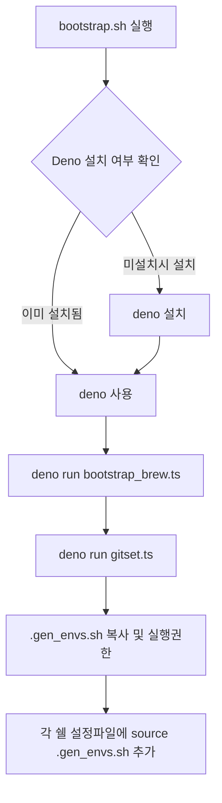

_

---

## 실행 흐름 도식

- `bootstrap.sh`가 전체 설치의 진입점입니다.
- Deno가 없으면 설치 후, Deno 기반 TypeScript 스크립트(`bootstrap_brew.ts`,
  `gitset.ts`)를 실행합니다.
- 환경 변수 스크립트(`.gen_envs.sh`)를 홈 디렉토리에 복사하고, 각 쉘 설정 파일에
  자동으로 소스합니다.
